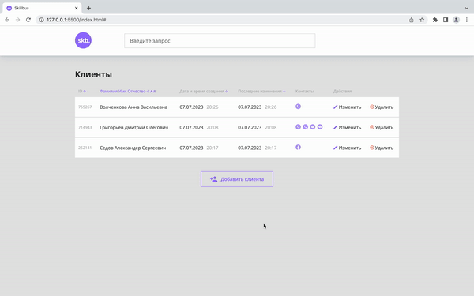

# Skillbus

### Техническое задание
Разработать web-интерфейс для CRM системы, в которой должны быть следующие возможности:
- Просмотр списка людей в виде таблицы
- Добавление нового клиента
- Изменение информации о существующем клиенте;

Каждый контакт представляет из себя следующий набор данных:
- Имя
- Фамилия
- Отчество

Массив объектов с контактными данными, где каждый объект содержит:
- Тип контакта (телефон, email, VK и т.п.)
-  Значение контакта (номер телефона, адрес email, ссылка на страницу в VK и т.п.)

Интерфейс представляет из себя единственную страницу, на которой располагается таблица клиентов, кнопка для добавления нового клиента, а также шапка с логотипом компании и строкой поиска клиентов.

Инструкция по запуску серверной части находиться в папке "crm-backend"